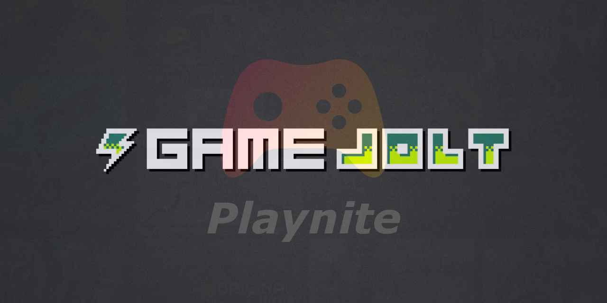

# GameJoltLibrary

This provides integration of your [Game Jolt](https://gamejolt.com/) games into [Playnite](https://playnite.link/).

Find on addons database: [Game Jolt Library](https://playnite.link/addons.html#GameJoltLibrary_555d58fd-a000-401b-972c-9230bed81aed)

## Features:
- Import installed games (requires [Game Jolt client](https://gamejolt.com/app))
- Import purchased games (Go to addon settings and enable + provide user name)
- Treat games followed in Game Jolt as owned (non installed) games
- Launch game
- Read metadata from offical store page
- Currently supported languages: English, German

## Contributing:
- Found a problem: [Create a issue](https://github.com/Mrxx99/Playnite.GameJoltLibrary/issues/new/choose)
- Have an idea for improvement: [Create an idea](https://github.com/Mrxx99/Playnite.GameJoltLibrary/discussions/new?category=ideas)
- Want to translate to other language: Create a pull request (Localization files are located [here](https://github.com/Mrxx99/Playnite.GameJoltLibrary/tree/main/src/GameJoltLibrary/Localization))
